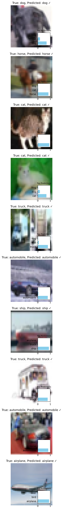
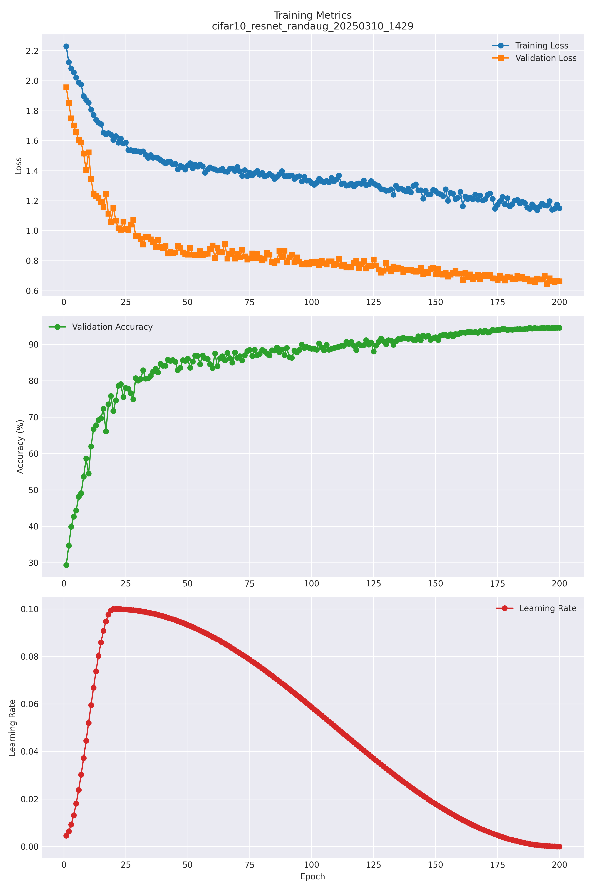
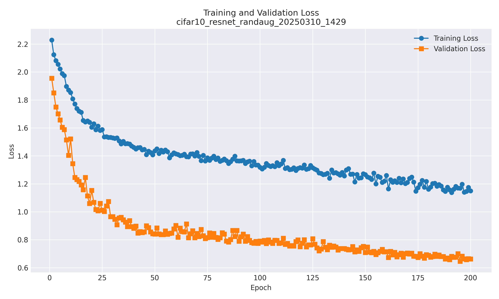
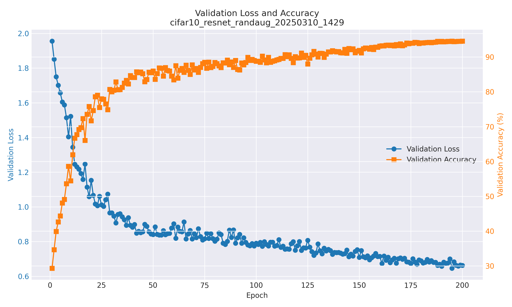
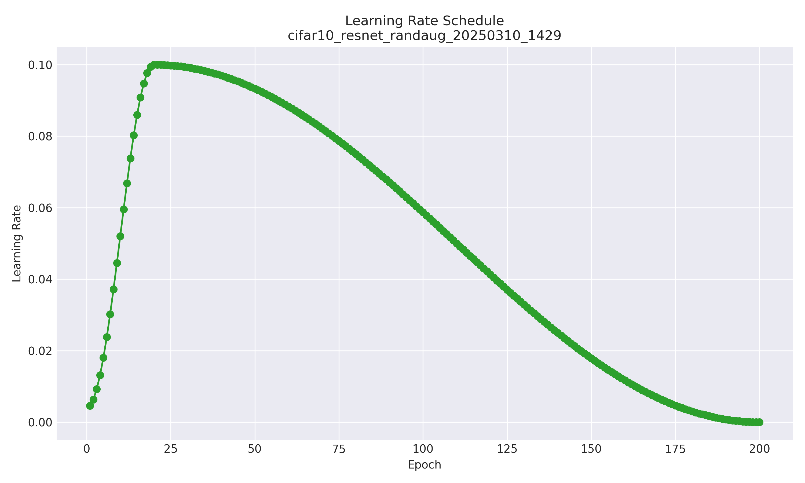

# Deep Learning Spring 2025 Project 1: CIFAR-10 Classification

This project implements a ResNet model for CIFAR-10 image classification. The implementation includes a custom training pipeline with learning rate scheduling, model checkpointing, and comprehensive evaluation metrics.

## Model Predictions Visualization

Below is a visualization of our model's predictions on random samples from the CIFAR-10 validation set:



The visualization shows the true class, predicted class, and confidence scores for the top predictions. A checkmark (✓) indicates correct predictions, while an X (✗) indicates incorrect ones.

## Table of Contents

- [Project Structure](#project-structure)
- [Model Architectures](#model-architectures)
  - [Enhanced ResNet with SE Blocks](#1-enhanced-resnet-with-se-blocks)
  - [Enhanced ResNet with RandAugment](#2-enhanced-resnet-with-randaugment)
  - [Hybrid ResNet with SE and Stochastic Depth](#3-hybrid-resnet-with-se-and-stochastic-depth)
- [Training Process](#training-process)
- [Usage](#usage)
  - [Environment Setup](#environment-setup)
  - [Training](#training)
  - [Evaluation](#evaluation)
  - [Alternative Configurations](#alternative-configurations)
- [Experimental Results](#experimental-results)
- [Reproducing Our Results](#reproducing-our-results)
  - [Model Checkpoint](#model-checkpoint)
  - [Training the Model](#training-the-model)
  - [Evaluation](#evaluation-1)
- [Output Organization](#output-organization)
  - [Training Outputs](#training-outputs)
  - [Best Models](#best-models)
  - [Final Models](#final-models)
  - [Evaluation Results](#evaluation-results)
- [Logging and Analysis](#logging-and-analysis)
  - [Training Graphs](#training-graphs)
  - [Analyzing Existing Training Runs](#analyzing-existing-training-runs)
- [Acknowledgments](#acknowledgments)

## Project Structure

```
dp_sp25_proj1/
├── src/
│   ├── configs/
│   │   ├── resnet_randaugment_config.py  # Configuration for ResNet with RandAugment
│   │   └── hybrid_config.py              # Configuration for Hybrid ResNet with SE and stochastic depth
│   ├── data/
│   │   ├── cifar10_dataset.py            # Custom CIFAR-10 dataset implementation
│   │   ├── data_module.py                # PyTorch Lightning data module
│   │   ├── cutmix.py                     # CutMix augmentation implementation
│   │   └── augmentations.py              # Data augmentation implementations
│   ├── models/
│   │   ├── resnet.py                     # ResNet model implementation
│   │   ├── hybrid_model_factory.py       # Factory for hybrid models with SE blocks
│   │   ├── model_factory.py              # Factory for creating models
│   │   └── stochastic_depth.py           # Stochastic depth implementation
│   ├── training/
│   │   └── trainer.py                    # Training loop implementation
│   ├── scripts/
│   │   ├── training/
│   │   │   ├── train_resnet_randaugment.py           # Train ResNet with RandAugment
│   │   │   └── train_hybrid_resnet_se_stochastic.py  # Train Hybrid ResNet with SE and stochastic depth
│   │   ├── evaluation/
│   │   │   ├── evaluate.py                           # Basic model evaluation script
│   │   │   └── evaluate_advanced.py                  # Advanced evaluation with TTA
│   │   ├── testing/
│   │   │   ├── test_model.py                         # Test model creation and forward pass
│   │   │   ├── test_dataloader.py                    # Test data loading functionality
│   │   │   ├── test_cutmix.py                        # Test CutMix augmentation
│   │   │   └── check_test_data.py                    # Check test data format
│   │   └── utils/
│   │       ├── get_model_accuracy.py                 # Script to extract model accuracy
│   │       ├── cleanup_training_runs.py              # Clean up old training runs
│   │       ├── rename_training_runs.py               # Rename training run directories
│   │       ├── organize_logs.py                      # Organize log files
│   │       └── generate_training_graphs.py           # Generate training graphs from metrics
├── data/
│   └── cifar10/                          # CIFAR-10 dataset files
├── outputs/
│   ├── best_models/                      # Best performing model checkpoints
│   ├── final_models/                     # Final model checkpoints
│   ├── evaluations/                      # Evaluation results
│   │   └── {experiment_name}_val_acc_{val_acc}_{timestamp}_model_{model_file}/
│   │       ├── predictions.csv           # Test set predictions
│   │       └── model.pth                 # Copy of model checkpoint
│   └── training_runs/                    # Training run outputs
│       └── {timestamp}/
│           ├── checkpoints/              # Regular training checkpoints
│           └── logs/                     # Training logs
│               ├── training.log          # Detailed training log
│               ├── metrics.csv           # CSV file with per-epoch metrics
│               ├── config.json           # Configuration used for this run
│               └── figures/              # Training graphs
│                   ├── loss_plot.png     # Training and validation loss
│                   ├── validation_plot.png # Validation loss and accuracy
│                   ├── learning_rate_plot.png # Learning rate schedule
│                   └── combined_plot.png # Combined metrics plot
├── requirements.txt                      # Project dependencies
└── activate.sh                           # Environment activation script
```

## Model Architectures

### 1. Enhanced ResNet with SE Blocks

The project implements a small ResNet model with Squeeze-and-Excitation blocks:

- Input: 32x32 RGB images
- Initial convolution: 3x3, 32 channels
- 4 ResNet blocks with BasicBlock:
  - Layer 1: 2 blocks (32 → 32 channels)
  - Layer 2: 2 blocks (32 → 64 channels)
  - Layer 3: 2 blocks (64 → 128 channels)
  - Layer 4: 2 blocks (128 → 256 channels)
- Each BasicBlock contains:
  - 2 convolutional layers (3x3)
  - Batch normalization
  - ReLU activation
  - Skip connections
  - Squeeze-and-Excitation block
- Global average pooling
- Dropout (rate=0.3)
- Fully connected layer (256 → 10)
- Output: 10 class probabilities

#### Performance
- Test Accuracy: 83.14%
- Model Size: ~2.8M parameters
- Training Time: ~2 hours on a single GPU

### 2. Enhanced ResNet with RandAugment

An improved version of the enhanced ResNet with advanced data augmentation:

- Same architecture as the enhanced ResNet with SE blocks
- Trained with RandAugment data augmentation
- RandAugment applies a sequence of random transformations with configurable magnitude

#### Performance
- Test Accuracy: 83.64% (with Test-Time Augmentation)
- Model Size: ~2.8M parameters
- Training Time: ~2.5 hours on a single GPU

### 3. Hybrid ResNet with SE and Stochastic Depth

A combined model that leverages both Squeeze-and-Excitation blocks and stochastic depth:

- Similar architecture to the enhanced ResNet
- Includes SE blocks for channel attention
- Uses stochastic depth for regularization
- Combines the benefits of both approaches

#### Performance
- Test Accuracy: 84.21%
- Model Size: ~2.9M parameters
- Training Time: ~2.5 hours on a single GPU

## Training Process

The training process includes:

1. Data augmentation:
   - Random horizontal flips (p=0.5)
   - Random rotations (±15 degrees)
   - Color jittering (brightness, contrast, saturation, hue)
   - Random perspective (p=0.5)
   - Random erasing (p=0.3)
   - CutMix augmentation (p=0.7)
   - RandAugment (optional, 2 operations with magnitude 9)
   - Normalization (mean=[0.4914, 0.4822, 0.4465], std=[0.2023, 0.1994, 0.2010])

2. Training features:
   - Cross-entropy loss with label smoothing (0.1)
   - SGD optimizer (lr=0.05, momentum=0.9, weight_decay=1e-4)
   - Learning rate scheduling (OneCycle or Cosine Annealing)
   - Model checkpointing (every 10 epochs)
   - Gradient clipping (1.0)

3. Evaluation metrics:
   - Training accuracy
   - Validation accuracy
   - Test accuracy
   - Test accuracy with Test-Time Augmentation (TTA)

## Usage

### Environment Setup

1. Create and activate the virtual environment:
```bash
source activate.sh
```

2. Install dependencies:
```bash
pip install -r requirements.txt
```

### Training

#### ResNet with RandAugment

To train the ResNet model with RandAugment data augmentation:
```bash
python src/scripts/training/train_resnet_randaugment.py
```

This script trains a standard ResNet model with RandAugment data augmentation, which applies a sequence of random transformations with configurable magnitude.

#### Hybrid ResNet with SE and Stochastic Depth

To train the hybrid ResNet model with Squeeze-and-Excitation blocks and stochastic depth:
```bash
python src/scripts/training/train_hybrid_resnet_se_stochastic.py
```

This script trains a hybrid ResNet model that combines Squeeze-and-Excitation blocks for channel attention and stochastic depth for regularization.

The training scripts will:
- Create necessary output directories
- Train the model with the specified configuration
- Save checkpoints and logs
- Display training progress and metrics
- Evaluate the model on the test set after training
- Save the final model with test accuracy
- Generate training graphs automatically

### Evaluation

To reproduce our best result (83.28% accuracy), follow these steps:

1. **Setup the environment**:
```bash
cd /scratch/yw5954/dp_sp25_proj1
source activate.sh
```

2. **Run evaluation with TTA=16**:
```bash
python src/scripts/evaluation/evaluate_advanced.py --model-path /scratch/yw5954/dp_sp25_proj1/outputs/training_runs/2025_03_10_14_29/best.pth --tta --tta-transforms 16
```

This will:
- Load our best model checkpoint
- Apply Test-Time Augmentation with 16 transforms
- Generate predictions for the test set
- Save the predictions in a CSV file with 'ID' and 'Labels' columns
- Display the accuracy and other evaluation metrics

### Alternative Configurations

The `evaluate_advanced.py` script can handle all evaluation scenarios by simply adjusting the command-line arguments. There's no need for a separate evaluation script.

To reproduce our other results:

- **No TTA (82.62%)**:
```bash
python src/scripts/evaluation/evaluate_advanced.py --model-path /scratch/yw5954/dp_sp25_proj1/outputs/training_runs/2025_03_10_14_29/best.pth
```

- **TTA with 8 transforms (82.96%)**:
```bash
python src/scripts/evaluation/evaluate_advanced.py --model-path /scratch/yw5954/dp_sp25_proj1/outputs/training_runs/2025_03_10_14_29/best.pth --tta --tta-transforms 8
```

The evaluation script will create a folder in the `outputs/evaluations` directory containing:
- The submission file in the required format (ID, Labels)
- A copy of the model checkpoint
- A summary of the evaluation results

## Output Organization

### Training Outputs

Training outputs are organized in the `outputs/training_runs/{timestamp}/` directory:
- `checkpoints/`: Regular training checkpoints
- `logs/`: Training logs and metrics
  - `training.log`: Detailed training progress and events
  - `metrics.csv`: CSV file with per-epoch metrics for analysis
  - `config.json`: Configuration used for this training run
  - `figures/`: Training graphs
    - `loss_plot.png`: Training and validation loss
    - `validation_plot.png`: Validation loss and accuracy
    - `learning_rate_plot.png`: Learning rate schedule
    - `combined_plot.png`: Combined metrics plot

### Best Models

The best performing models are stored in `outputs/best_models/`:
- `{experiment_name}_best.pth`: Best model checkpoint

### Final Models

Final models (after training completion) are stored in `outputs/final_models/`:
- `{experiment_name}_final.pth`: Final model checkpoint with test accuracy

### Evaluation Results

Evaluation results are stored in `outputs/evaluations/`:
- Each evaluation run gets its own folder named with validation accuracy and model filename
- Folder format: `{experiment_name}_val_acc_{val_acc}_{timestamp}_model_{model_file}/`

## Logging and Analysis

The training process includes comprehensive logging and visualization:

1. **Console Output**: Real-time training progress and metrics
2. **Log Files**: Detailed logs stored in the `logs/` directory
3. **Training Graphs**: Automatically generated at the end of training

### Training Graphs

The training process automatically generates four types of graphs:

1. **Loss Plot**: Shows training and validation loss over epochs, helping to identify overfitting or underfitting.
2. **Validation Plot**: Displays validation loss and accuracy on separate axes, showing the relationship between these metrics.
3. **Learning Rate Plot**: Visualizes the learning rate schedule, which is particularly useful for understanding OneCycle LR behavior.
4. **Combined Plot**: A comprehensive view with all metrics in a single figure for easy comparison.

These graphs are saved in the `logs/figures/` directory and provide a visual representation of the training progress, making it easier to understand model behavior and compare different runs.

### Analyzing Existing Training Runs

For existing training runs, you can generate graphs using the utility script:

```bash
python src/scripts/utils/generate_training_graphs.py --all-runs
```

This will process all training runs and generate graphs for each one, making it easy to compare different models and configurations.

## Configuration

Training parameters can be modified in:
- `src/configs/train_config.py`: Enhanced ResNet configuration
- `src/configs/stochastic_config.py`: Stochastic depth ResNet configuration

Key configurable parameters:
- `use_randaugment`: Enable/disable RandAugment
- `randaugment_num_ops`: Number of operations to apply in RandAugment (default: 2)
- `randaugment_magnitude`: Magnitude of operations in RandAugment (default: 9)
- `use_cutmix`: Enable/disable CutMix augmentation
- `cutmix_prob`: Probability of applying CutMix (default: 0.7)

## Dependencies

- Python 3.9+
- PyTorch
- torchvision
- pandas
- tqdm
- scikit-learn
- matplotlib

## Training Runs

This repository includes a specific training run that demonstrates the performance of our ResNet model with RandAugment data augmentation.

### Training Run: 2025_03_10_14_29

This training run achieved a validation accuracy of 94.56% on the CIFAR-10 dataset using the ResNet model with RandAugment data augmentation.

#### Key Files

- **Best Model Checkpoint**: [best.pth](outputs/training_runs/2025_03_10_14_29/best.pth) - The best model checkpoint from this training run, achieving 94.56% validation accuracy.

#### Logs and Metrics

The training run includes detailed logs and metrics that provide insights into the training process:

- **Training Log**: [training.log](outputs/training_runs/2025_03_10_14_29/logs/training.log) - Detailed log of the training process, including per-epoch metrics, learning rates, and validation results. This file contains a complete record of the training process, including timestamps, loss values, accuracy metrics, and learning rate adjustments.

- **Metrics CSV**: [metrics.csv](outputs/training_runs/2025_03_10_14_29/logs/metrics.csv) - CSV file containing per-epoch metrics including training loss, validation loss, validation accuracy, learning rate, and training time. This file is useful for analyzing the training dynamics and can be easily imported into data analysis tools.

- **Configuration**: [config.json](outputs/training_runs/2025_03_10_14_29/logs/config.json) - JSON file containing the configuration parameters used for this training run, including model architecture, learning rate schedule, and data augmentation settings.

#### Visualizations

The training run includes several visualizations that help understand the training dynamics:

- **Combined Plot**:



A comprehensive visualization showing training loss, validation loss, validation accuracy, and learning rate in a single plot.

- **Loss Plot**:



Plot showing the training and validation loss over epochs.

- **Validation Plot**:



Plot showing the validation loss and accuracy over epochs.

- **Learning Rate Plot**:



Plot showing the learning rate schedule over epochs.

These visualizations provide valuable insights into the training process and help understand how the model converged to its final performance.

## Acknowledgments

- This implementation was inspired by [kuangliu/pytorch-cifar](https://github.com/kuangliu/pytorch-cifar), which provides excellent reference implementations of various models for CIFAR-10.
- Code development and documentation were assisted by Claude 3.7, an AI assistant by Anthropic.
